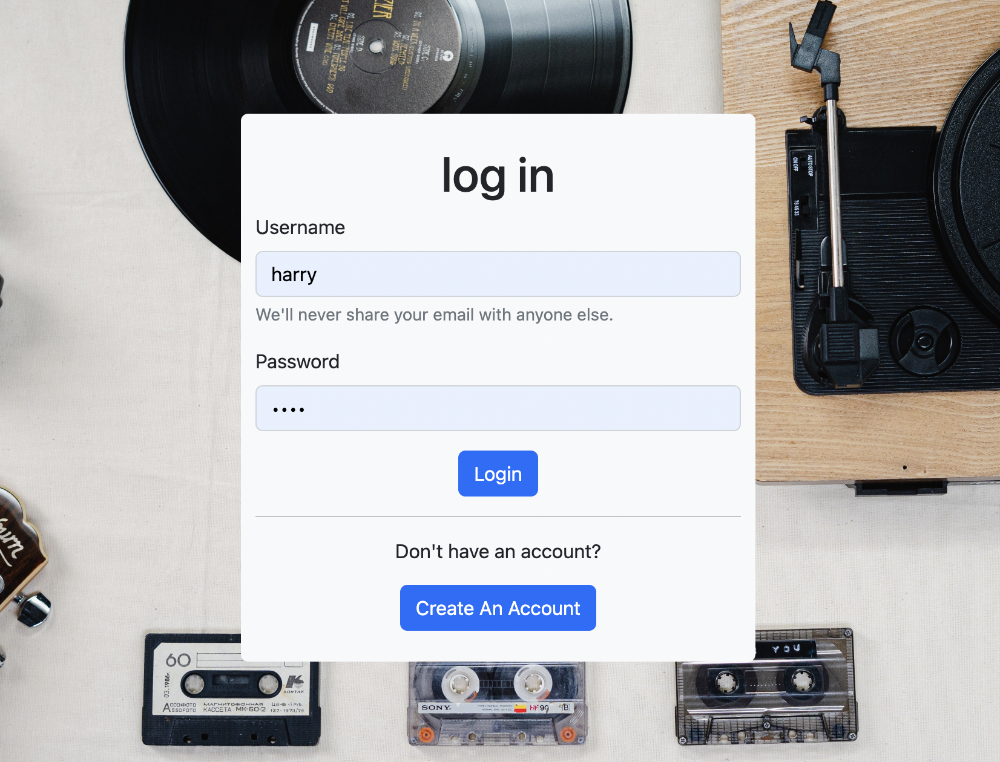
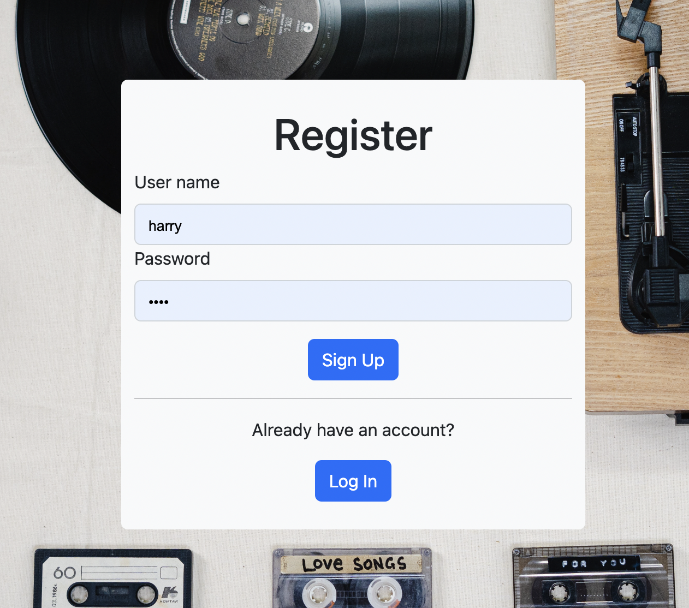
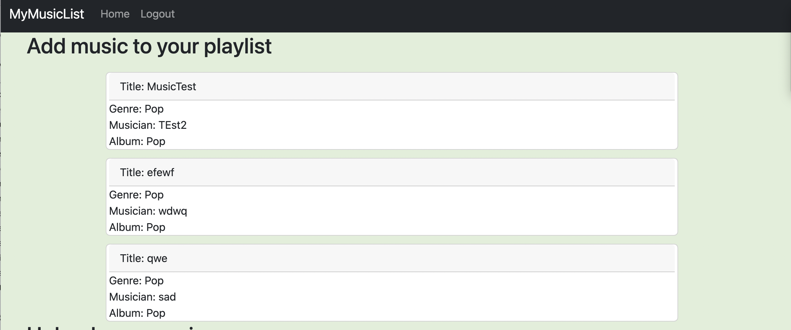
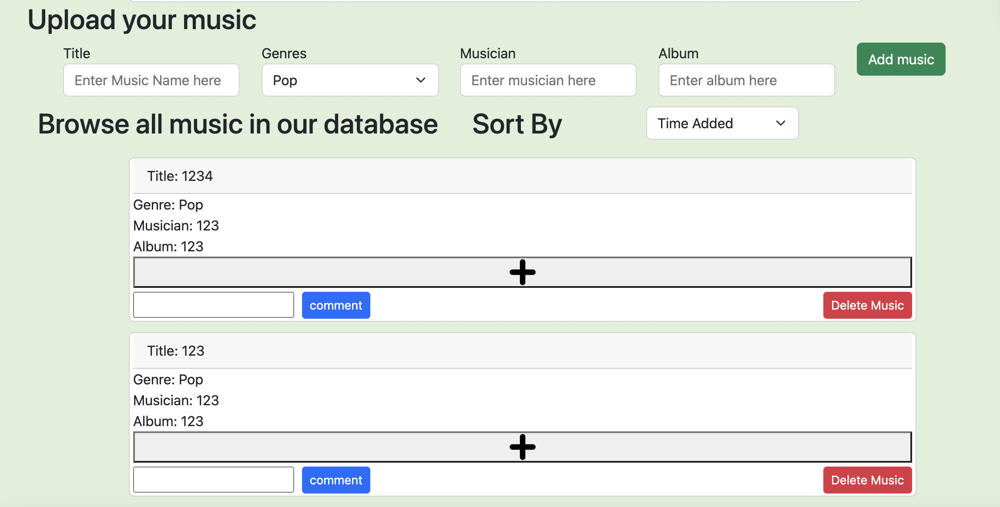

# myMusicList

This is the repository for myMusicList which is an online music platform that allows registered users to record music, albums, musicians and create playlist and comments for music. 

This project was made for [CS5610](https://johnguerra.co/classes/webDevelopment_fall_2022/).

### Author 

[Xingjian Bi](https://github.com/Xingjian-Bi) &  [Yi Zhou](https://github.com/HotdrynoodlesTauren)

### Objective

The objective is build a simple backend design using express, mongoDB, HTML and JavaScript. Deploy on Heroku. We developed a musiclist that allow users to track their favourite music and share with others. Users can also comment on other's music. The tech stack is listed below. 

### [Delpoyed Link Here](https://spooky-cemetery-51302.herokuapp.com/index.html) 

### Slides & Video Demonstration

[Slides Here](https://docs.google.com/presentation/d/1RwSYsR2OH-B2uB_fhBd0DnnnSNI1Mydjoj_SuGS40jE/edit?usp=sharing)

[Video Here](https://youtu.be/xpvoCw-G1m0)

### Tech Requirements

- HTML5
- CSS
- Bootstrap
- JavaScript
- Node.js
- Express
- JavaScript

### To Install Locally

1. download the source code
2. install node.js to your machine 
3. run `npm install` and `npm start`
4. set your mongoDB by modify `url` vairable in db/myMusicList. 
5. your project will be runing on localhost:8000
6. Register your account and enjoy!

### Screenshots

